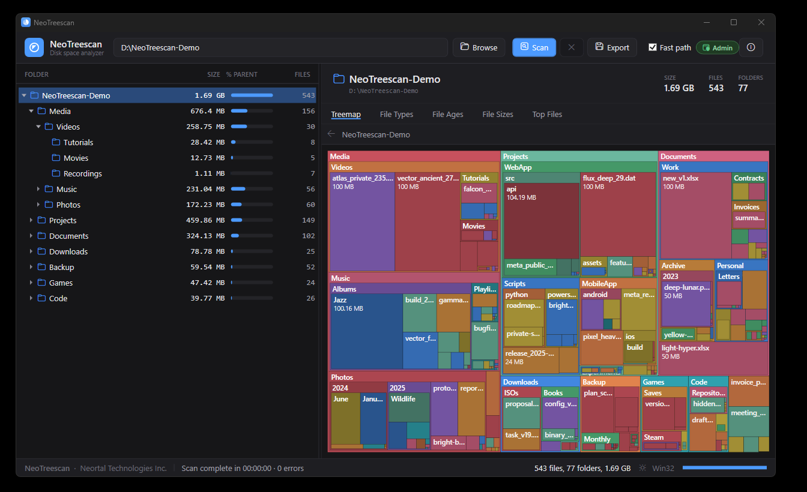
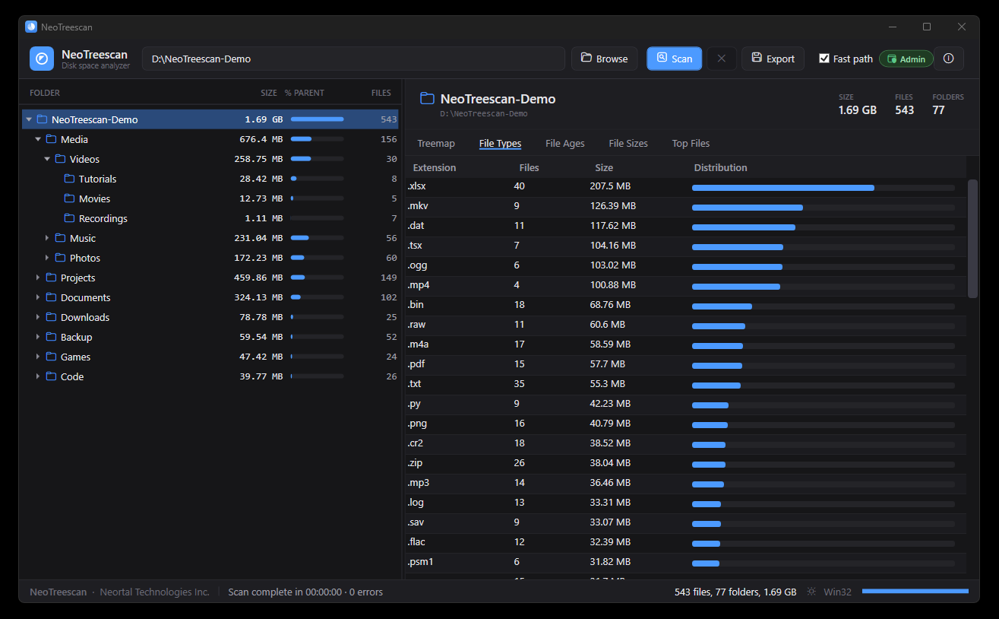
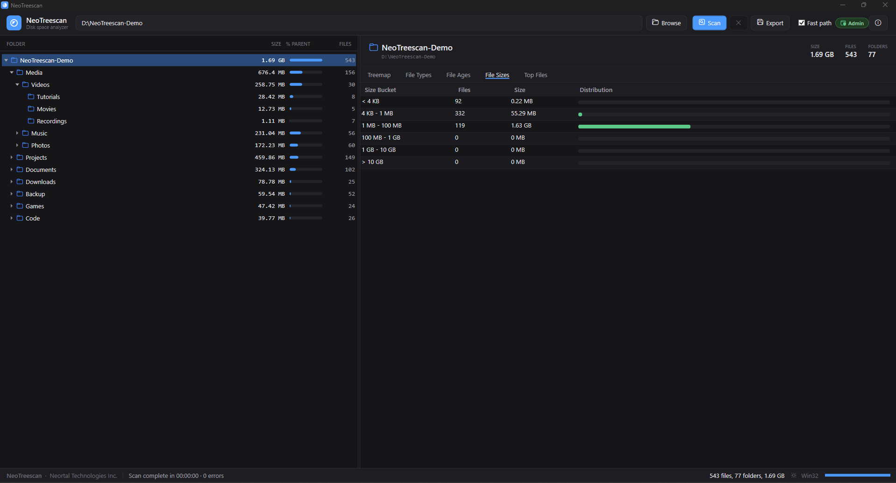
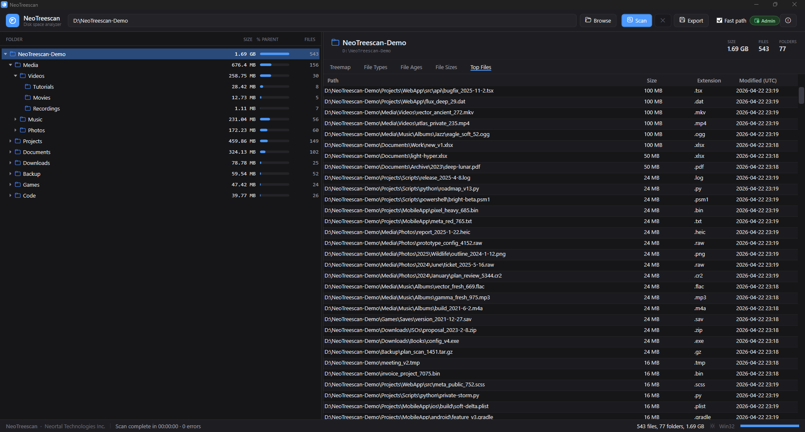
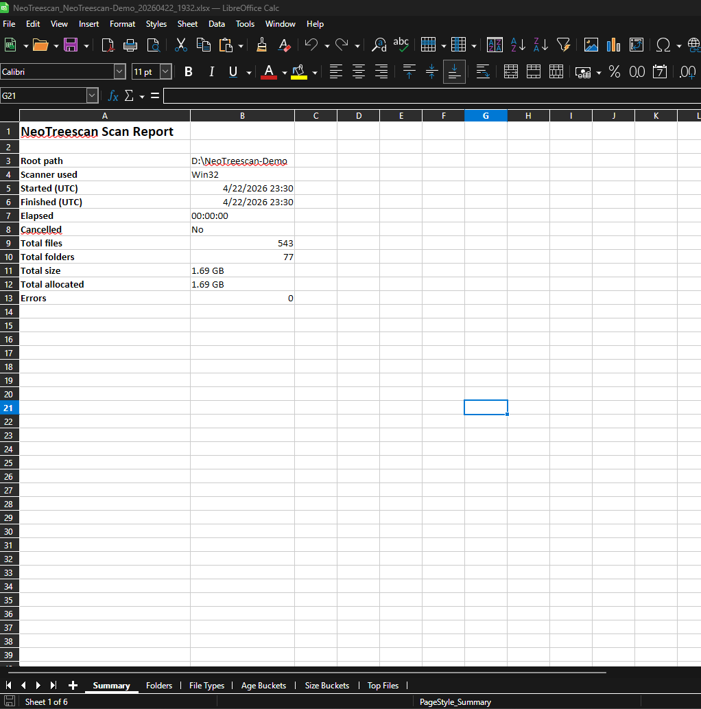
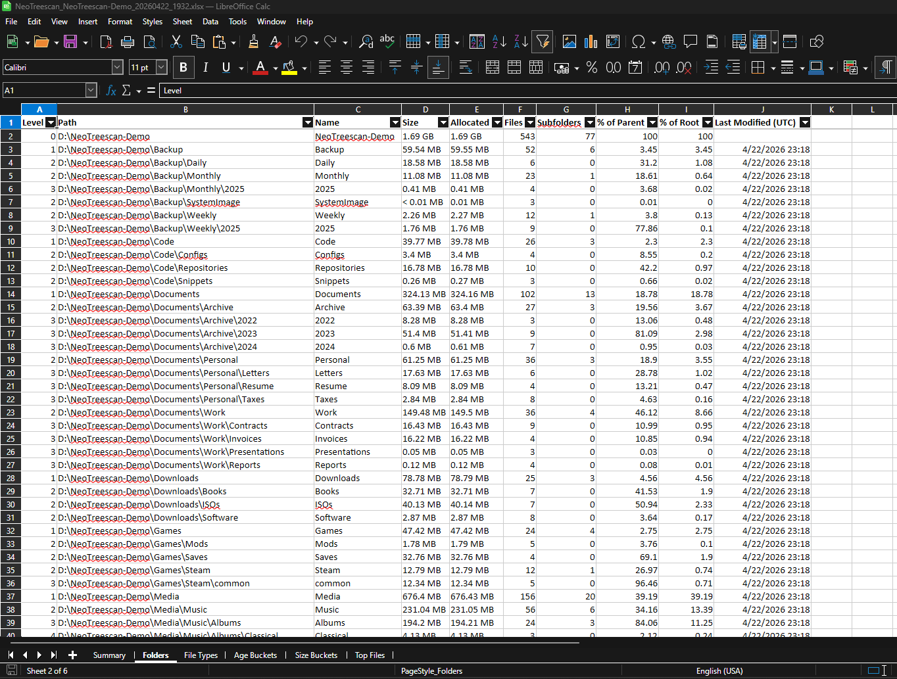
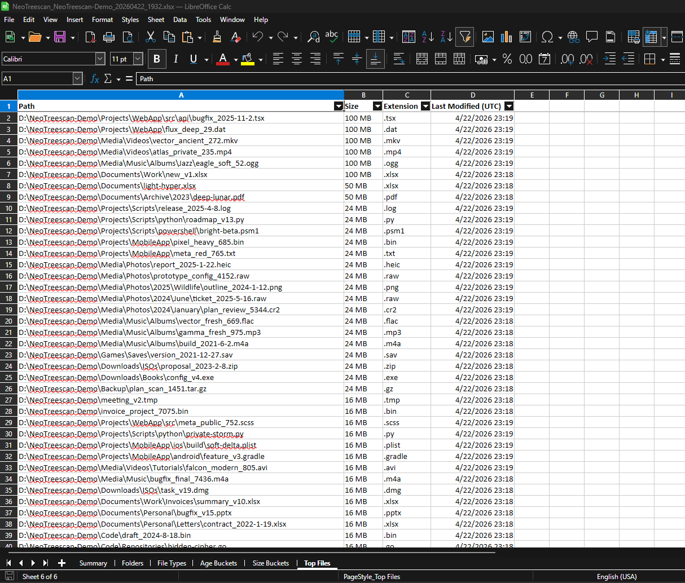
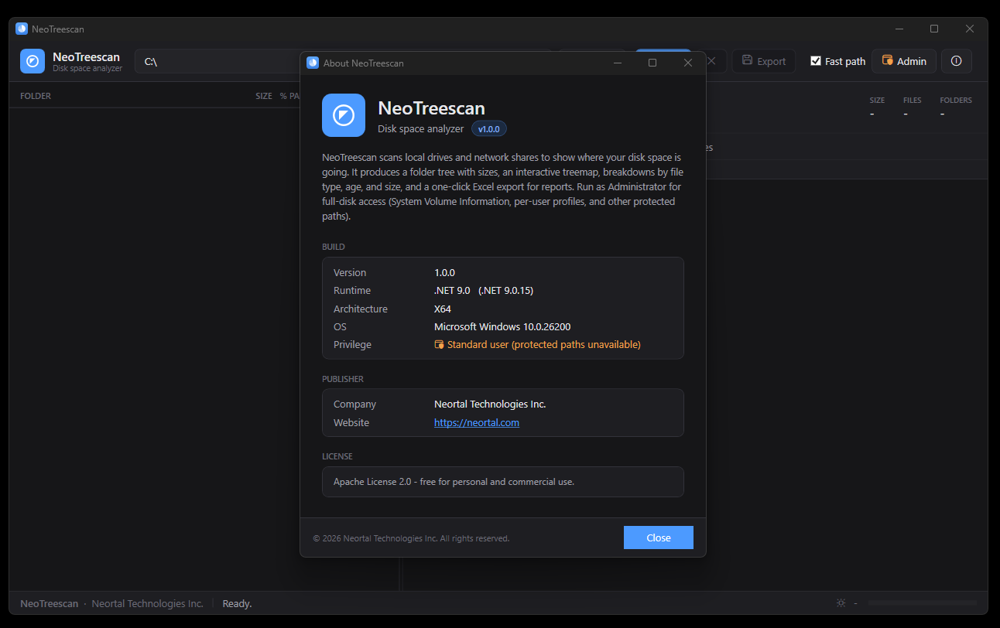

# NeoTreescan

[](LICENSE)
[](https://dotnet.microsoft.com/download/dotnet/9.0)
[](#requirements)
[](#download)

A free, open-source Windows disk-space analyzer. Scan any drive, folder, or UNC
share and see exactly where your disk space went. Get an interactive folder
tree, a clickable treemap, breakdowns by file type, age, and size, and a
one-click Excel export.

Ships as a single self-contained `.exe` built on **.NET 9** and **WPF**. No
installer, no runtime prerequisites, no telemetry, no cost.

> Published by **Neortal Technologies Inc.** (<https://neortal.com>).
> Licensed under Apache License 2.0.

---

## Table of Contents

- [Why we built this](#why-we-built-this)
- [Features](#features)
- [Screenshots](#screenshots)
- [Download](#download)
- [Requirements](#requirements)
- [Quick start](#quick-start)
- [Usage guide](#usage-guide)
- [Keyboard shortcuts](#keyboard-shortcuts)
- [Excel export](#excel-export)
- [Build from source](#build-from-source)
- [Architecture](#architecture)
- [Scanners](#scanners)
- [Rebranding](#rebranding)
- [FAQ](#faq)
- [Troubleshooting](#troubleshooting)
- [Contributing](#contributing)
- [Security](#security)
- [Disclaimer](#disclaimer)
- [License](#license)
- [Acknowledgments](#acknowledgments)

---

## Why we built this

We built NeoTreescan because we ran into the problem ourselves and could not
find a single tool that did all of the following for free:

- Analyze disk usage with an interactive view of folders and files.
- Export the results to Excel so a report can be shared or archived.
- See hidden files and folders, including protected locations under the
  current user that Explorer usually hides.

Every option we tried either locked the Excel export behind a paid tier, did
not surface hidden or protected paths, or came with some other catch. So we
wrote our own, and we are releasing it so anyone else in the same spot can
use it without paying, installing anything, or handing over their data.

## Features

### Scanning
- **Fast recursive scan** via Win32 `FindFirstFileExW` with the
  `FIND_FIRST_EX_LARGE_FETCH` hint and parallelized directory enumeration at
  the top levels. Comfortably handles millions of files.
- **Long path support** - paths over 260 characters via the `\\?\` prefix.
- **UNC and network share support** - scan `\\server\share` paths directly.
- **Admin mode** - enables `SeBackupPrivilege` so protected paths
  (`System Volume Information`, `$Recycle.Bin`, other-user profiles, ACL-locked
  directories) are included in the scan.
- **Reparse-point safe** - symlinks and junctions are not followed, so there
  are no infinite loops and no double counting.
- **Cancellable** - press `Esc` or the Cancel button to stop a running scan at
  any time.

### Visualization
- **Folder tree** with inline percent bars showing each folder's contribution
  to its parent.
- **Squarified treemap** with file-level rendering. Click any block to drill
  in; the breadcrumb above the treemap shows your current path.
- **Right-click context menu** on folders: Open in Explorer, Copy path, Set as
  scan root.
- **Drag-and-drop** a folder from Explorer onto the window to scan it.
- **Dark theme** including the Windows 11 immersive dark title bar.

### Analysis tabs
- **By file type** - extension, count, total size, percent of root.
- **By age** - buckets (<7d, 7-30d, 30-90d, 90-365d, 1-2y, >2y).
- **By size** - buckets (<4KB, 4KB-1MB, 1MB-100MB, 100MB-1GB, 1-10GB, >10GB).
- **Top 1000 files** - the largest files anywhere under the scan root.

Every tab has inline proportional bars for quick visual scanning.

### Export
- **Excel (.xlsx) export** via ClosedXML. Six sheets: Summary, Folders, File
  Types, Age Buckets, Size Buckets, Top Files. See [Excel export](#excel-export)
  below.

### Everything else
- **MB / GB / TB sizes everywhere** - a single consistent format in the UI and
  the Excel export. No raw byte counts.
- **No telemetry, no network calls**. NeoTreescan never contacts the internet.
- **Portable**. Copy `NeoTreescan.exe` to a USB stick or a share and run it
  anywhere, no installer, no registry footprint.

## Screenshots

### Main window



The tree on the left sorts folders by size with inline percent bars. The
treemap on the right renders every folder and file as a proportionally-sized
rectangle - click any block to drill in.

### Analysis tabs

| By file type | By size bucket |
|---|---|
|  |  |
| Every extension under the scan root, ranked by total size, with a file count and a distribution bar. | Files grouped into `<4KB`, `4KB-1MB`, `1MB-100MB`, `100MB-1GB`, `1-10GB`, and `>10GB` buckets. |

### Top 1000 files



### Excel export

One click and you get a six-sheet `.xlsx` workbook with all sizes formatted
as `MB`/`GB`/`TB` - no raw byte counts.



| Folders sheet | Top Files sheet |
|---|---|
|  |  |

### About dialog



## Download

Grab the latest `NeoTreescan.exe` from the [Releases](../../releases) page.

The published EXE is roughly 65 MB compressed. It bundles the .NET 9 runtime,
WPF, and ClosedXML so that it will run on any supported Windows machine with
no additional setup.

> **SmartScreen warning**: the current release is unsigned, so Windows
> SmartScreen will show "Unknown publisher" on first run. Click **More info**
> then **Run anyway**. See [FAQ](#faq).

## Requirements

- **Windows 10 version 1809 (build 17763) or later**, Windows 11, or Windows
  Server 2019 / 2022. Older Windows releases are not supported by .NET 9.
- **x64 architecture**. ARM64 is not currently shipped.
- No .NET runtime install required - the EXE is self-contained.
- Administrator privileges are **optional** and only needed to scan protected
  paths.

## Quick start

1. Download `NeoTreescan.exe` from the latest release.
2. Double-click to launch. The app opens without any install step.
3. Click **Browse...**, pick a drive or folder, and hit **Scan** (or press
   `F5`). Drag-and-drop a folder onto the window also works.
4. Click folders in the left tree or blocks in the treemap to explore.
5. Use the tabs below the treemap to analyze by file type, age, size, or to
   see the largest files.
6. Click **Export to Excel** (`Ctrl+E`) to save a `.xlsx` report.

For full disk access, click **Run as Admin** in the toolbar and approve the
UAC prompt.

## Usage guide

### Scanning a local drive

Pick a drive letter like `C:\` in the Browse dialog and press Scan. On a
typical SSD with a million files, expect a cold scan to finish in 30-90
seconds and a warm scan (filesystem cache populated) to finish in 10-30
seconds.

### Scanning a network share

Type or paste the UNC path (`\\server\share\folder`) into the path box and
press Scan. You will need Windows credentials to the share; Explorer's
existing session is reused.

### Admin mode

Many system folders are ACL-restricted even for members of the Administrators
group. Click **Run as Admin** in the toolbar and approve the UAC prompt to
relaunch with `SeBackupPrivilege` enabled. This lets NeoTreescan enumerate:

- `C:\System Volume Information\` (Volume Shadow Copy store)
- `C:\$Recycle.Bin\` per-user subfolders
- `C:\Users\<other-user>\` profiles
- any other ACL-locked directory where Administrators have traverse rights

Without admin, these paths are skipped and the totals will under-report.

### Reading the treemap

Each rectangle's area is proportional to the folder's or file's total size.
Folders are rendered in shades of blue; individual files (shown at the leaf
level) in warmer colors. Click a folder to zoom into it; the breadcrumb above
the map lets you jump back up.

### Reading the tree

The left tree shows folders only, sorted by size descending. The inline bar
next to each folder is the percentage of the parent folder's size, so you can
visually walk the hot path from the root to the heavy leaf.

## Keyboard shortcuts

| Shortcut  | Action                                |
|-----------|---------------------------------------|
| `F5`      | Start scan of the current path        |
| `Esc`     | Cancel the running scan               |
| `Ctrl+O`  | Browse for a folder                   |
| `Ctrl+E`  | Export the current scan to Excel      |
| `Ctrl+L`  | Focus the path input                  |

## Excel export

Opens in both Microsoft Excel and LibreOffice Calc. Six sheets:

| Sheet         | Columns                                                                                       |
|---------------|-----------------------------------------------------------------------------------------------|
| Summary       | Root path, scanner used, start / end, duration, totals, errors                                |
| Folders       | Level, Path, Name, Size, Allocated, Files, Subfolders, % Parent, % Root, Last Modified        |
| File Types    | Extension, File Count, Size, % of Total                                                       |
| Age Buckets   | Bucket (<7d, 7-30d, 30-90d, 90-365d, 1-2y, >2y), File Count, Size, %                          |
| Size Buckets  | Bucket (<4KB, 4KB-1MB, 1MB-100MB, 100MB-1GB, 1-10GB, >10GB), File Count, Size, %              |
| Top Files     | Path, Size, Extension, Last Modified (largest 1000 files)                                     |

All size columns are formatted `MB` / `GB` / `TB` strings. There are no raw
byte numbers.

## Build from source

### Requirements

- Windows 10 1809+ or Windows 11
- [.NET 9 SDK](https://dotnet.microsoft.com/download/dotnet/9.0)

### Steps

```powershell
# Clone
git clone https://github.com/neortal-technologies/NeoTreescan.git
cd NeoTreescan

# Restore + build
dotnet build NeoTreescan.sln -c Release

# Produce the single-file self-contained EXE
dotnet publish src/NeoTreescan.App/NeoTreescan.App.csproj -c Release
# Output:
# src/NeoTreescan.App/bin/Release/net9.0-windows/win-x64/publish/NeoTreescan.exe
```

The published EXE is around 65 MB compressed and bundles the .NET runtime,
WPF, and ClosedXML. Copy it anywhere and run.

### Regenerating the app icon

The icon is generated programmatically from
[tools/iconbuilder/Program.cs](tools/iconbuilder/Program.cs). Edit the drawing
code there (colors, geometry, wedges) and regenerate:

```powershell
dotnet run --project tools/iconbuilder -c Release -- "src/NeoTreescan.App/Resources/NeoTreescan.ico"
```

## Architecture

```
NeoTreescan.sln
├── src/
│   ├── NeoTreescan.Core/              (net9.0-windows, no UI)
│   │   ├── Models/                    FolderNode, FileEntry, ScanResult
│   │   ├── Scanning/                  IDirectoryScanner, Win32DirectoryScanner,
│   │   │                              MftScanner (stub), ScannerSelector
│   │   ├── Analysis/                  Aggregators (type/age/size), SizeFormat
│   │   ├── Export/                    ExcelExporter (ClosedXML)
│   │   └── Interop/                   NativeMethods (P/Invoke), LongPath, Privilege
│   └── NeoTreescan.App/               (net9.0-windows WPF, WinExe)
│       ├── MainWindow.xaml            Toolbar, tree, details strip, tabs, status bar
│       ├── AboutWindow.xaml           About dialog
│       ├── Controls/                  TreemapControl (custom OnRender)
│       ├── ViewModels/                MainViewModel, FolderNodeViewModel, row VMs
│       ├── Converters/                ByteSizeConverter, PercentConverter
│       ├── Resources/NeoTreescan.ico
│       ├── Branding.cs                Product name, company, version, description
│       ├── WindowTheme.cs             DWM immersive-dark-mode toggle
│       └── app.manifest               long-path aware, DPI-per-monitor-v2, asInvoker
└── tools/
    └── iconbuilder/                   One-off tool that generates the multi-res .ico
```

**Core** has no UI dependencies and can be consumed from a console tool, a
scheduled task, or automated tests.

**App** is the WPF shell around Core. All display formatting (sizes, percents,
colors) lives here. `Branding.cs` is the single rebrand point.

## Scanners

`ScannerSelector` picks the appropriate scanner:

- **Win32DirectoryScanner** (default) - `FindFirstFileExW` with
  `FIND_FIRST_EX_LARGE_FETCH`, long-path prefix, parallel BFS at the top two
  levels. Skips reparse points (no junction loops).
- **MftScanner** - placeholder type for raw NTFS MFT parsing
  (`FSCTL_ENUM_USN_DATA` + `FSCTL_GET_NTFS_FILE_RECORD`). Currently falls back
  to Win32 and reports as `MFT(fallback)`. Not fully implemented.

## Rebranding

All user-facing product strings (name, tagline, company, website, copyright,
description, license) live in one file:
[src/NeoTreescan.App/Branding.cs](src/NeoTreescan.App/Branding.cs). Edit the
constants, rebuild, done. To also rename the EXE file, change `<AssemblyName>`
in
[src/NeoTreescan.App/NeoTreescan.App.csproj](src/NeoTreescan.App/NeoTreescan.App.csproj).

## FAQ

### Why is the EXE so large?

Around 65 MB is expected. The single-file EXE bundles:

- the entire .NET 9 runtime (about 30 MB)
- WPF (PresentationCore, PresentationFramework, WindowsBase, native graphics
  like `wpfgfx_cor3.dll` and `D3DCompiler_47_cor3.dll`, about 60-80 MB
  uncompressed)
- the app code and ClosedXML

Compression is enabled; without it the EXE would be twice as large. The
tradeoff is that the app "just runs" anywhere with no prerequisites.

### Why does Windows show a SmartScreen warning?

The EXE is not currently code-signed. Click **More info** then **Run anyway**
on the SmartScreen dialog.

### Does NeoTreescan modify or delete my files?

No. NeoTreescan is strictly read-only. It enumerates the filesystem, records
metadata, and renders the results. It never opens files for write, never
deletes anything, and never moves files around.

### Does it send telemetry or contact the internet?

No. There are no analytics, no update checks, no network calls of any kind.

### Does it work offline, on air-gapped machines?

Yes. Copy the EXE over, run it, done. No licensing server, no activation.

### Why does an admin scan pick up more files than a normal scan?

System folders like `System Volume Information`, `$Recycle.Bin`, and
other-user profiles have ACLs that block even Administrators by default.
Admin mode enables `SeBackupPrivilege`, which lets NeoTreescan bypass those
ACLs (same privilege backup software uses). The total can easily be tens of
GB higher on a well-used machine.

### Can I script it / run it headless?

Not at the moment. NeoTreescan currently runs as an interactive WPF app.

### Which filesystems are supported?

NTFS, ReFS, FAT32, exFAT, and network filesystems exposed via SMB / UNC. The
Win32 scanner does not depend on any specific filesystem.

## Troubleshooting

**The scan finishes but some folders show as zero.**
Those folders are probably ACL-locked. Try Run as Admin.

**Scan is slow on a network share.**
Remote enumeration is bound by SMB round-trip latency. Expect 10x slower than
a local SSD. Scan from a machine physically close to the share for best
results.

**Excel export fails with "file is open".**
Close the `.xlsx` in Excel before re-exporting.

**App is blurry on a hi-DPI monitor.**
The app declares per-monitor-v2 DPI awareness. If it still looks blurry,
check Windows settings for any compatibility overrides on the EXE
(Properties -> Compatibility -> Change high DPI settings).

## Contributing

Contributions are welcome. Please read [CONTRIBUTING.md](CONTRIBUTING.md) and
the [Code of Conduct](CODE_OF_CONDUCT.md) before opening a PR.

In short:

- Keep the UI layer free of business logic. All scanning and aggregation
  lives in `NeoTreescan.Core`.
- Stick to the MVVM pattern already in use (`CommunityToolkit.Mvvm`).
- Run `dotnet build` and smoke-test your change before submitting.

Issue and PR templates live in [.github/](.github/).

## Security

If you believe you have found a security issue, please do **not** open a
public issue. Follow the process in [SECURITY.md](SECURITY.md).

## Disclaimer

NeoTreescan is provided **AS IS**, without warranty of any kind, express or
implied, including the warranties of merchantability, fitness for a
particular purpose, and non-infringement. Use at your own risk, especially
when running in Administrator mode with elevated privileges.

See the full disclaimer in [LICENSE](LICENSE) (Apache License 2.0, sections
7 and 8).

## License

NeoTreescan is released under the **Apache License, Version 2.0**. See
[LICENSE](LICENSE) for the full text and [NOTICE](NOTICE) for attribution
requirements.

You are free to use, modify, and distribute NeoTreescan (including in
commercial and proprietary products), provided that you preserve the
copyright and license notices. Apache 2.0 also grants an express patent
license and does not grant permission to use the trade names, trademarks, or
product names of the Licensor.

© 2026 Neortal Technologies Inc.

## Acknowledgments

- [.NET](https://dotnet.microsoft.com/) and [WPF](https://learn.microsoft.com/dotnet/desktop/wpf/) - runtime and UI framework
- [ClosedXML](https://github.com/ClosedXML/ClosedXML) - Excel export
- [CommunityToolkit.Mvvm](https://learn.microsoft.com/dotnet/communitytoolkit/mvvm/) - source-generator-based MVVM helpers
- The Windows API documentation on `FindFirstFileExW`, `SeBackupPrivilege`,
  and the `\\?\` long-path prefix
